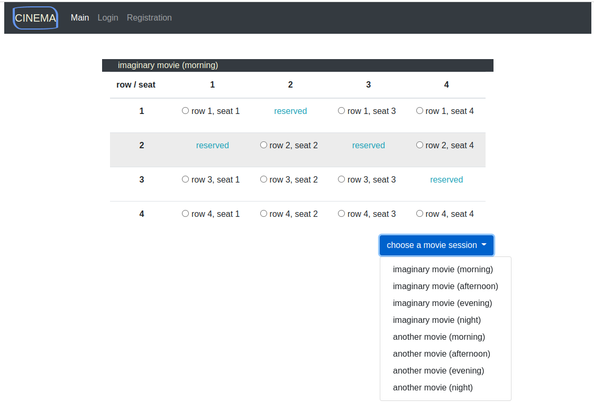
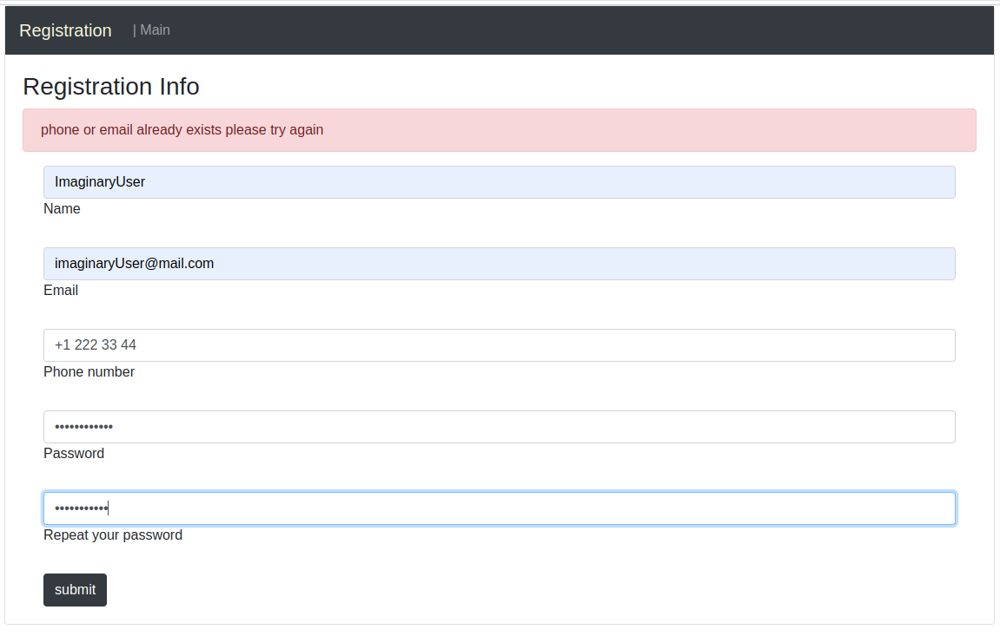
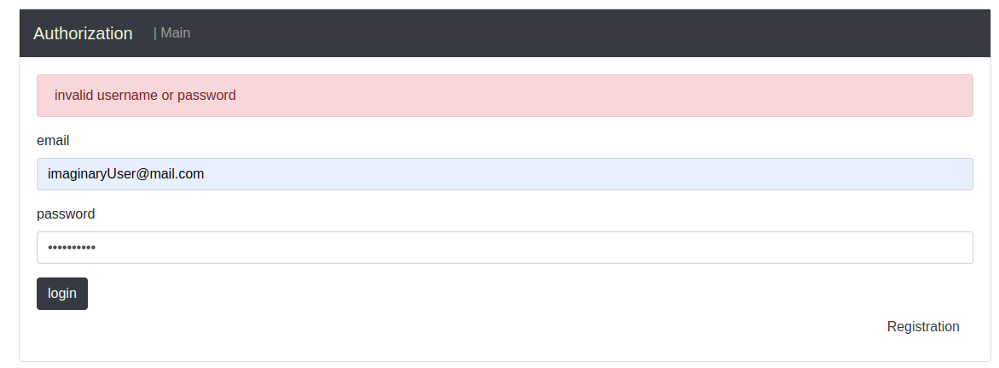
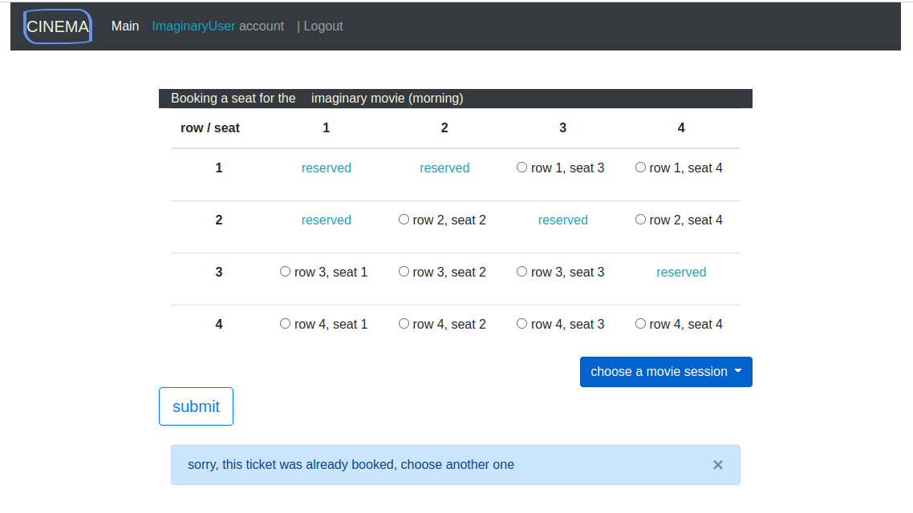
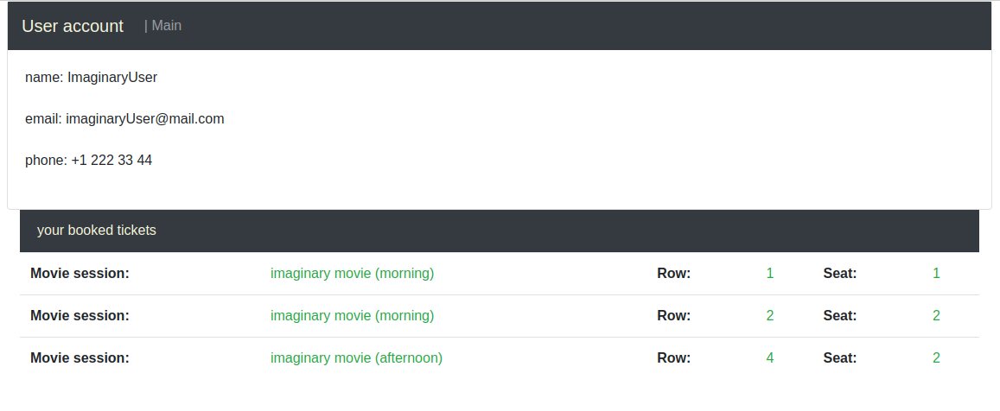
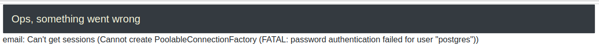

# Cinema tickets booking Spring Boot App

 
Service for booking tickets to the cinema.

<h2>Technologies</h2>
<ul>
    <li>Spring Boot</li>
    <li>Spring MVC</li>
    <li>Spring AOP</li>
    <li>Bootstrap</li>
    <li>Thymeleaf</li>
    <li>Postgres</li>
    <Li>liquibase</Li>
    <li>slf4j, logback</li>
    <li>Junit</li>
    <li>Mockito</li>
</ul>

### 1. The user sees available and already booked sessions

to be able to book a ticket, user need to register and log in
(if an email address is already reserved, user sees an error message)

after that, user needs to log
in (if the password is incorrect, the user sees an error)

### 2. Booking tickets:

After authorization, confirm button is available to the user,
which books tickets for the selected session and redirects to user's personal account
(if two users try to book the same ticket
at the same time, the one who first clicks the "Submit" button will book,
the second user will receive an error message that the ticket has already been booked)

If login was successful, the user will be redirected to his personal account, which contains his data
and information about all tickets booked by him.

User can repeat the process to book more tickets by returning to Main.
 
 
Also user can see application errors on a separate page, such as for example
no entity in database or the unavailability of the database server or password fail etc

